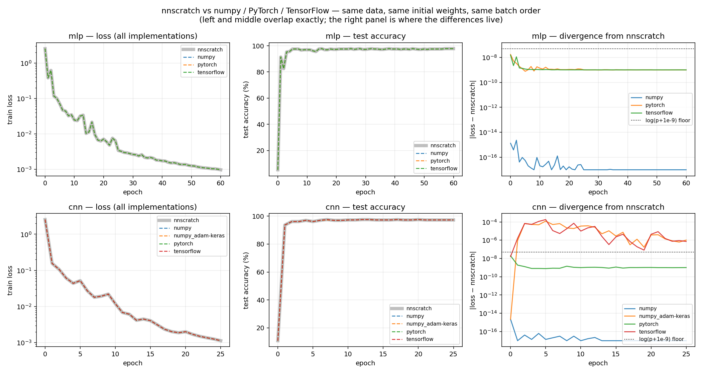

# Reference implementations

The same network, trained four ways: **nnscratch (C++)**, **numpy**,
**PyTorch**, and **TensorFlow/Keras** — on the same data, from the same initial
weights, in the same mini-batch order. Everything is held fixed except *who
computes the gradients*, so whatever difference survives is attributable to the
framework rather than to luck.

This turns the correspondence table in the top-level
[README](../README.md#numpy--c--framework-correspondence) and the "four layers
of difference" in [experiments.md](../docs_en/experiments.md) from claims into
something you can run.

- [Result](#result)
- [How to reproduce](#how-to-reproduce)
- [Why an export step is needed](#why-an-export-step-is-needed)
- [What each script does](#what-each-script-does)
- [The two layout traps](#the-two-layout-traps)
- [Where TensorFlow diverges, and why](#where-tensorflow-diverges-and-why)
- [Export file formats](#export-file-formats)

---

## Result

Measured on the machine these notes were written on, float64 throughout,
PyTorch 2.12.0+cpu and TensorFlow 2.20.0:

**MLP** — 64→64→32→10, SGD(0.3), 60 epochs

| implementation | final test acc | max \|loss gap\| | max \|acc gap\| | verdict |
|---|---|---|---|---|
| nnscratch | 0.9778 | — | — | baseline |
| numpy | 0.9778 | 2.3e-15 | 0 | identical |
| PyTorch | 0.9778 | 1.7e-08 | 0 | identical |
| TensorFlow | 0.9778 | 1.5e-08 | 0 | identical |

**CNN** — Conv2D(1→8, 3×3) → ReLU → Flatten → Dense(10), Adam(0.01), 25 epochs

| implementation | final test acc | max \|loss gap\| | max \|acc gap\| | verdict |
|---|---|---|---|---|
| nnscratch | 0.9722 | — | — | baseline |
| numpy | 0.9722 | 2.2e-15 | 0 | identical |
| PyTorch | 0.9722 | 2.0e-08 | 0 | identical |
| TensorFlow | 0.9722 | 1.8e-04 | 0 | same predictions, loss drifts |
| numpy, Keras-form Adam | 0.9722 | 1.2e-04 | 2.8e-03 | control — reproduces the drift |

Reading the numbers:

- **2e-15** is float64 round-off. numpy and nnscratch are running the same
  arithmetic in a different order, and nothing else separates them.
- **2e-08** is not a disagreement either: nnscratch reports
  $\log(p + 10^{-9})$ where the frameworks report $\log p$
  ([MATH.md](../docs_en/MATH.md#numerical-stability)). It is a reporting floor
  in the metric, present already at epoch 0, and the gradients never see it.
- **1.8e-04**, TensorFlow's CNN, is a real difference — see
  [below](#where-tensorflow-diverges-and-why).
- **Every prediction agrees in every run.** The accuracy columns are exactly
  zero apart from the deliberate control.

So the honest headline is: *with the randomness removed, an MLP trained by hand
in C++ and an MLP trained by autograd are the same computation.* The
`loss.backward()` you do not write is doing what the derivations in
[MATH.md](../docs_en/MATH.md) say it does.



The left and middle panels are all four implementations plotted on top of each
other; they are indistinguishable, which is the point. The right panel plots the
gap to nnscratch on a log axis — that is where the information is, and where
the TensorFlow CNN curve separates from the rest, tracking the deliberate
Keras-form control exactly.

*(`curves.png` is the one generated file kept in the repository, so that this
page renders on GitHub. `compare_curves.py` rewrites it in place; everything
else it reads lives in the gitignored `output/reference/`.)*

---

## How to reproduce

```bash
# 1. build and export (a few seconds)
cmake -S . -B build -DCMAKE_BUILD_TYPE=Release
cmake --build build --config Release
./build/export_reference                      # -> output/reference/

# 2. install the Python side (this directory only -- the library needs nothing)
python -m pip install -r reference/requirements.txt

# 3. train the same networks three more ways
python reference/numpy_reference.py
python reference/pytorch_reference.py
python reference/tensorflow_reference.py

# 4. overlay and quantify
python reference/compare_curves.py
```

Each script takes `--model {mlp,cnn,both}` and `--dtype {float64,float32}`.
`float64` is the default because it matches nnscratch; running `--dtype float32`
shows how much of a framework's real-world behaviour is precision rather than
algorithm — difference layer ② in
[experiments.md](../docs_en/experiments.md).

To settle the optimizer questions on their own, without any network:

```bash
python reference/check_optimizer_equivalence.py
```

To check whether experiment 3's architecture ranking survives more than one
seed — it partly does not, see
[experiments.md](../docs_en/experiments.md#what-actually-happens):

```bash
python reference/architecture_trials.py --seeds 10
```

---

## Why an export step is needed

You cannot reproduce an nnscratch run from its seeds on the Python side.

`Rng` wraps `std::mt19937_64`, whose output the C++ standard pins down bit for
bit. But `Rng::normal` and `Rng::permutation` go through
`std::normal_distribution` and `std::uniform_int_distribution`, and the standard
does **not** specify how those map engine output to values. Different standard
libraries produce different weights and different shuffles from the same seed —
which is also why the README quotes an accuracy range rather than one number
([ARCHITECTURE.md](../docs_en/ARCHITECTURE.md#determinism)).

So the three things that would otherwise be luck travel as data instead:

| Exported | Why |
|---|---|
| train/test split indices | `permutation()` is not portable |
| initial weights | `normal_distribution` is not portable |
| per-epoch mini-batch order | `permutation()` again, once per epoch |

`apps/export_reference.cpp` writes all three, plus nnscratch's own learning
curve to compare against. It verifies its own split replay before writing:
it re-parses `digits.csv`, applies the permutation it is about to export, and
checks the result against `load_digits()` element by element, requiring a
difference of exactly zero.

---

## What each script does

| File | Role |
|---|---|
| `common.py` | Parses the export and slices mini-batches. numpy only. |
| `numpy_reference.py` | The implementation nnscratch was ported *from*: every `backward` written out by hand, including im2col/col2im. No autograd. |
| `pytorch_reference.py` | Same network, `loss.backward()` doing the work. |
| `tensorflow_reference.py` | Same network, `tf.GradientTape` doing the work. |
| `compare_curves.py` | Overlays every curve found, prints the divergence table, writes the plot. |
| `check_optimizer_equivalence.py` | Drives one scalar parameter through each framework's SGD/Momentum/Adam and identifies which closed-form update it implements. |
| `architecture_trials.py` | Repeats experiment 3 across many seeds, because one seed cannot rank three models that finish within a point of each other. |

All three training scripts use an explicit mini-batch loop rather than
`model.fit()` or a `DataLoader`, for two reasons: the exported batch order has
to be followed exactly, and the loop makes the one thing under study — where
the gradients come from — visible in the source.

`numpy_reference.py` is worth reading next to `src/`. It is the same derivations
in a language where they are shorter, and the comments mark the places the C++
mirrors.

---

## The two layout traps

Transferring weights is not quite mechanical. Both traps are silent: the model
trains, the loss goes down, and the answer is wrong.

**1. Dense weight orientation.** nnscratch stores $W$ as
$(n_{\mathrm{in}}, n_{\mathrm{out}})$ and computes $xW$. Keras stores its kernel
the same way — so it transfers untouched — but `torch.nn.Linear` stores
$(n_{\mathrm{out}}, n_{\mathrm{in}})$ and computes $xW^\top$, so the PyTorch
port transposes on the way in.

**2. Flatten ordering after a convolution.** This is the subtle one. nnscratch's
`Flatten` runs over $(N, C, H, W)$ and is channel-major:
$(c, h, w) \mapsto cHW + hW + w$. PyTorch keeps tensors in NCHW, so
`nn.Flatten` produces exactly that. Keras convolves in **NHWC**, so its
`Flatten` would produce *spatial*-major order — the same numbers in a different
sequence, feeding permuted inputs into the next Dense layer. Nothing errors;
you simply train a different network.

The fix in `tensorflow_reference.py` is a `Permute((3, 1, 2))` before the
flatten, which restores channel-major ordering without touching the weights.
The conv kernel itself also needs transposing, from nnscratch's
$(C_{\mathrm{out}}, C_{\mathrm{in}}, k, k)$ to Keras's
$(k, k, C_{\mathrm{in}}, C_{\mathrm{out}})$.

Both frameworks cross-correlate without flipping the kernel, exactly as
nnscratch's im2col does, so no flip is needed anywhere
([MATH.md](../docs_en/MATH.md#conv2d-via-im2col)).

That the CNN's epoch-0 loss agrees to 1.6e-08 across all four implementations is
the evidence these transfers are right: epoch 0 is a pure forward pass on
untrained weights, so any layout mistake would show up there immediately.

---

## Where TensorFlow diverges, and why

The TensorFlow CNN is the one run that does not track the others. Its epoch-0
loss agrees to 1.6e-08 — so the weights arrived correctly — but by the end the
loss differs by 1.8e-04. The MLP shows nothing of the sort. The difference is
Adam, and `check_optimizer_equivalence.py` pins it down by measurement:

**Structural: where $\varepsilon$ enters.** nnscratch and **PyTorch** both apply
it after bias correction. Keras applies it to the *un-corrected* second moment —
the "$\hat\varepsilon$" of the Kingma–Ba paper, as the Keras documentation
states:

```math
\text{nnscratch / PyTorch}: \quad p \leftarrow p - \eta\,\frac{\hat m}{\sqrt{\hat v} + \varepsilon}
```

```math
\text{Keras}: \quad \alpha_t = \eta\,\frac{\sqrt{1 - \beta_2^{\,t}}}{1 - \beta_1^{\,t}}, \qquad p \leftarrow p - \alpha_t\,\frac{m}{\sqrt{v} + \varepsilon}
```

Per step that is worth about $2.5 \times 10^{-9}$ at the default
$\varepsilon = 10^{-8}$ — but the CNN run takes roughly 1100 steps. Running the
numpy reference with `--adam-form keras` reproduces a divergence of the same
size and shape, which is what attributes the effect rather than merely
correlating with it.

**Numerical: float32 hyperparameters.** Even with
`keras.backend.set_floatx('float64')`, Keras stores scalar optimizer
hyperparameters (`momentum`, `beta_1`, `beta_2`, `epsilon`) as float32. The
learning rate is a Variable and does keep float64. `momentum=0.9` therefore
becomes 0.89999997615814208984375, and `check_optimizer_equivalence.py` shows
Keras's momentum trajectory matching the closed form to **exactly zero** only
once $\mu$ is rounded the same way.

Accounting for both takes the single-parameter Adam gap from ~9e-02 down to
~4e-08. A residual remains, consistent with Keras accumulating the moments as
increments (`m += (g - m)(1 - \beta_1)`) rather than as
`m = \beta_1 m + (1 - \beta_1) g`; it is not chased further here.

None of this is a bug in anything. It is difference layer ③ of
[experiments.md](../docs_en/experiments.md), made concrete: **the update rule
you read in a paper and the update rule a framework ships are not always the
same expression**, and at $10^{-8}$ nobody notices until they try to reproduce a
run exactly. Note also what did *not* change: every prediction, at every epoch,
in every implementation.

---

## Export file formats

Written by `export_reference` to `output/reference/`, all plain text.
Regenerate rather than commit them — `output/` is gitignored.

| File | Contents |
|---|---|
| `split.txt` | `n_records`, `n_train`, `n_test`, then `train` / `test` blocks of 0-based indices into `digits.csv` record order |
| `<model>_config.txt` | `key value` lines plus one `layer <i> <type> <args...>` per layer |
| `<model>_init_weights.txt` | `tensor <name> <rank> <dims...>` followed by row-major values at 17 significant digits |
| `<model>_batch_order.txt` | `epoch <n>` followed by a permutation of `[0, n_train)`, one block per epoch |
| `<model>_curve_nnscratch.csv` | `epoch,train_loss,train_acc,test_acc` |

`<model>` is `mlp` or `cnn`. The Python scripts write their own
`<model>_curve_<implementation>.csv` alongside, in the same CSV shape.
Seventeen significant digits round-trips an IEEE double exactly, so the weights
cross the language boundary without loss.

The dataset itself is *not* exported — both sides read `data/digits.csv`
directly and the split indices tell each which rows to take. Full CSV spec in
[DATA_FORMATS.md](../docs_en/DATA_FORMATS.md#digitscsv-input).
